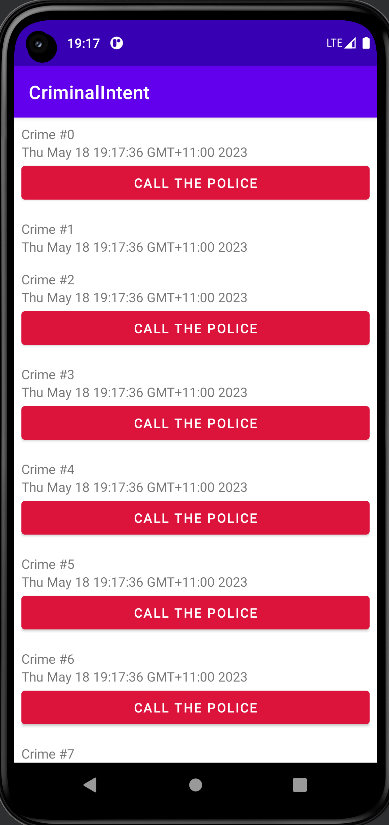

<p align = "center">МИНИСТЕРСТВО НАУКИ И ВЫСШЕГО ОБРАЗОВАНИЯ
РОССИЙСКОЙ ФЕДЕРАЦИИ
ФЕДЕРАЛЬНОЕ ГОСУДАРСТВЕННОЕ БЮДЖЕТНОЕ
ОБРАЗОВАТЕЛЬНОЕ УЧРЕЖДЕНИЕ ВЫСШЕГО ОБРАЗОВАНИЯ
«САХАЛИНСКИЙ ГОСУДАРСТВЕННЫЙ УНИВЕРСИТЕТ»</p>
<br><br><br><br><br><br>
<p align = "center">Институт естественных наук и техносферной безопасности<br>Кафедра информатики<br>Хроменков Владимир Александрович</p>
<br><br><br>

<p align = "center">Лабораторная работа №8<br>Вывод списков и RecyclerView<br>01.03.02 Прикладная математика и информатика</p>
<br><br><br><br><br><br><br><br><br><br><br><br>
<p align = "right">Научный руководитель<br>
Соболев Евгений Игоревич</p>
<br><br><br>
<p align = "center">г. Южно-Сахалинск<br>2023 г.</p>

***
# <p align = "center">Оглавление</p>
- [Цели и задачи](#цели-и-задачи)
- [Решение задач](#решение-задач)
- [Вывод](#вывод)

***

# <p align = "center">Цели и задачи</p>

Упражнение. Типы View в RecyclerView 

Для этого сложного упражнения вам нужно будет создать два типа строк в вашем RecyclerView: для обычных и для более серьезных преступлений. Чтобы это реализовать, вы будете работать с функцией в RecyclerView.Adapter. Присвойте новое свойство requiresPolice объекту Crime и используйте его, чтобы определить, какой тип View загружен в CrimeAdapter, путем реализации функции getItemViewType(Int) (developer.android.com/reference/android/support/v7/widget/RecyclerView.Adapter.html#getItemViewType). В функции onCreateViewHolder(ViewGroup, Int) вам также необходимо добавить логику, которая возвращает различные ViewHolder в зависимости от ViewType, возвращаемого функцией getItemViewType(Int). Используйте оригинальный макет для преступлений, которые не требуют вмешательства полиции, и новый макет с усовершенствованным интерфейсом, содержащий кнопку с надписью «Связаться с полицией» для серьезных преступлений.

# <p align = "center">Решение задач</p>

`MainActivity`
```kotlin
import androidx.appcompat.app.AppCompatActivity
import android.os.Bundle

class MainActivity : AppCompatActivity() {
    override fun onCreate(savedInstanceState: Bundle?) {
        super.onCreate(savedInstanceState)
        setContentView(R.layout.activity_main)

        val currentFragment =
            supportFragmentManager.findFragmentById(R.id.fragment_container)

        if (currentFragment == null) {
            val fragment = CrimeListFragment.newInstance()
            supportFragmentManager
                .beginTransaction()
                .add(R.id.fragment_container, fragment)
                .commit()
        }
    }
}
```

`CrimeListViewModel`
```kotlin
import androidx.lifecycle.ViewModel
import kotlin.random.Random

class CrimeListViewModel : ViewModel() {
    val crimes = mutableListOf<Crime>()
    init {
        for (i in 0 until 100) {
            val crime = Crime()
            crime.title = "Crime #$i"
            crime.isSolved = i % 2 == 0
            crime.requiresPolice = Random.nextBoolean()
            crimes += crime
        }
    }
}
```

`CrimeListFragment`
```kotlin
import android.os.Bundle
import android.util.Log
import android.view.LayoutInflater
import android.view.View
import android.view.ViewGroup
import android.widget.Button
import android.widget.TextView
import android.widget.Toast
import androidx.fragment.app.Fragment
import androidx.lifecycle.ViewModelProviders
import androidx.recyclerview.widget.LinearLayoutManager
import androidx.recyclerview.widget.RecyclerView

private const val TAG = "CrimeListFragment"
class CrimeListFragment : Fragment() {
    private lateinit var crimeRecyclerView: RecyclerView
    private var adapter: CrimeAdapter? = null
    private lateinit var callPoliceButton: Button

    private val crimeListViewModel: CrimeListViewModel by lazy {
        ViewModelProviders.of(this).get(CrimeListViewModel::class.java)
    }
    override fun onCreate(savedInstanceState: Bundle?) {
        super.onCreate(savedInstanceState)
        Log.d(TAG, "Total crimes: ${crimeListViewModel.crimes.size}")
    }

    override fun onCreateView(
        inflater: LayoutInflater,
        container: ViewGroup?,
        savedInstanceState: Bundle?
    ): View? {
        val view = inflater.inflate(R.layout.fragment_crime_list, container, false)

        crimeRecyclerView =
            view.findViewById(R.id.crime_recycler_view) as RecyclerView
        crimeRecyclerView.layoutManager = LinearLayoutManager(context)

        updateUI()

        return view
    }

    private fun updateUI() {
        val crimes = crimeListViewModel.crimes
        adapter = CrimeAdapter(crimes)
        crimeRecyclerView.adapter = adapter
    }

    private inner class CrimeHolder(view: View)
        : RecyclerView.ViewHolder(view), View.OnClickListener{
        private lateinit var crime: Crime

        private val titleTextView: TextView = itemView.findViewById(R.id.crime_title)
        private val dateTextView: TextView = itemView.findViewById(R.id.crime_date)

        init {
            itemView.setOnClickListener(this)
        }

        fun bind(crime: Crime) {
            this.crime = crime
            titleTextView.text = this.crime.title
            dateTextView.text = this.crime.date.toString()

            if(crime.requiresPolice == true){
                callPoliceButton = itemView.findViewById(R.id.call_police_button)
                callPoliceButton.setOnClickListener{
                    Toast.makeText(context, R.string.call_police_text,Toast.LENGTH_SHORT).show()
                }

            }
        }

        override fun onClick(v: View) {
            Toast.makeText(context, "${crime.title} pressed!", Toast.LENGTH_SHORT)
                .show()
        }
    }

    private inner class CrimeAdapter(var crimes: List<Crime>)
        : RecyclerView.Adapter<CrimeHolder>() {
        override fun onCreateViewHolder(parent: ViewGroup, viewType: Int)
                : CrimeHolder {
            val layout = when(viewType){
                0 -> R.layout.list_item_crime
                else -> R.layout.list_item_crime_call_police
            }

            val view = layoutInflater.inflate(layout, parent, false)
            return CrimeHolder(view)
        }

        override fun getItemCount() = crimes.size
        override fun onBindViewHolder(holder: CrimeHolder, position: Int) {
            val crime = crimes[position]
            holder.bind(crime)
        }
        override fun getItemViewType(position: Int): Int {
            val crime = crimes[position]

            return if (crime.requiresPolice) 1 else 0
        }
    }

    companion object {
        fun newInstance(): CrimeListFragment {
            return CrimeListFragment()
        }
    }
}
```

`CrimeFragment`
```kotlin
package com.example.lab8

import android.os.Bundle
import android.text.Editable
import android.text.TextWatcher
import android.view.LayoutInflater
import android.view.View
import android.view.ViewGroup
import android.widget.Button
import android.widget.CheckBox
import android.widget.EditText
import androidx.fragment.app.Fragment

class CrimeFragment : Fragment() {

    private lateinit var crime: Crime
    private lateinit var titleField: EditText
    private lateinit var solvedCheckBox: CheckBox
    private lateinit var dateButton: Button


    override fun onCreate(savedInstanceState: Bundle?) {
        super.onCreate(savedInstanceState)
        crime = Crime()
    }
    override fun onCreateView(
        inflater: LayoutInflater,
        container: ViewGroup?,
        savedInstanceState: Bundle?
    ): View? {
        val view = inflater.inflate(R.layout.fragment_crime, container, false)
        titleField = view.findViewById(R.id.crime_title) as EditText
        dateButton = view.findViewById(R.id.crime_date) as Button
        dateButton.apply {
            text = crime.date.toString()
            isEnabled = false
        }
        solvedCheckBox = view.findViewById(R.id.crime_solved) as CheckBox


        return view
    }

    override fun onStart() {
        super.onStart()
        val titleWatcher = object : TextWatcher {
            override fun beforeTextChanged(
                sequence: CharSequence?,
                start: Int,
                count: Int,
                after: Int
            ) {
                // Это пространство оставлено пустым специально
            }
            override fun onTextChanged(
                sequence: CharSequence?,
                start: Int,
                before: Int,
                count: Int
            ) {
                crime.title = sequence.toString()
            }
            override fun afterTextChanged(sequence: Editable?) {
                // И это
            }
        }
        titleField.addTextChangedListener(titleWatcher)
        solvedCheckBox.apply {
            setOnCheckedChangeListener { _, isChecked ->
                crime.isSolved = isChecked
            }
        }
    }
}
```

`Crime`
```kotlin
package com.example.lab8

import java.util.Date
import java.util.UUID

data class Crime(val id: UUID = UUID.randomUUID(),
                 var title: String = "",
                 var date: Date = Date(),
                 var isSolved: Boolean = false,
                 var requiresPolice: Boolean = false)
```

`activity_main.xml`
```kotlin
<?xml version="1.0" encoding="utf-8"?>
<FrameLayout
    xmlns:android="http://schemas.android.com/apk/res/android"
    android:id="@+id/fragment_container"
    android:layout_width="match_parent"
    android:layout_height="match_parent"/>
```

`fragment_crime_list`
```kotlin
<?xml version="1.0" encoding="utf-8"?>
<androidx.recyclerview.widget.RecyclerView
    xmlns:android="http://schemas.android.com/apk/res/android"
    android:id="@+id/crime_recycler_view"
    android:layout_width="match_parent"
    android:layout_height="match_parent" />

```

`list_item_crime`
```kotlin
<?xml version="1.0" encoding="utf-8"?>
<LinearLayout xmlns:android="http://schemas.android.com/apk/res/android"
    android:orientation="vertical"
    android:layout_width="match_parent"
    android:layout_height="wrap_content"
    android:padding="8dp">

    <TextView
        android:id="@+id/crime_title"
        android:layout_width="match_parent"
        android:layout_height="wrap_content"
        android:text="Crime Title" />

    <TextView
        android:id="@+id/crime_date"
        android:layout_width="match_parent"
        android:layout_height="match_parent"
        android:text="Crime Date" />

</LinearLayout>

```

`list_item_crime_call_police`

```kotlin
<?xml version="1.0" encoding="utf-8"?>
<LinearLayout xmlns:android="http://schemas.android.com/apk/res/android"
    android:orientation="vertical"
    android:layout_width="match_parent"
    android:layout_height="wrap_content"
    android:padding="8dp">

    <TextView
        android:id="@+id/crime_title"
        android:layout_width="match_parent"
        android:layout_height="wrap_content"
        android:text="Crime Title" />

    <TextView
        android:id="@+id/crime_date"
        android:layout_width="match_parent"
        android:layout_height="match_parent"
        android:text="Crime Date" />

    <Button
        android:id="@+id/call_police_button"
        android:layout_width="match_parent"
        android:layout_height="wrap_content"
        android:backgroundTint="@color/red"
        android:text="@string/call_police_button" />

</LinearLayout>
```

<p align = "center">
    
</p>

# <p align = "center">Вывод</p>
Выполнив *лабораторную работу №8*, совершенствую навыки работы со средой разработки `Android Studion`. Изучил работу `RecyclerView` на практике.